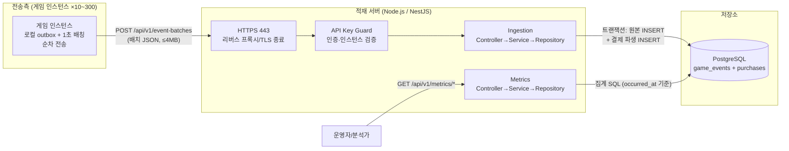

# 게임 로그 적재 파이프라인 설계 문서 — v2

> [문제 1] 제출 문서. 전송 제약 분석 → 아키텍처 → 적재 API → 저장 스키마 → 지표 정의 →
> 집계 API 순으로 기술하며, 각 결정의 근거와 트레이드오프를 함께 남긴다.
> 가정은 assumptions.md에 번호로 관리하며 본문에서 [A-n]으로 참조한다.
>
> **v2 변경 요약** (외부 설계 검토 반영): ① 트래픽 산정 정정(인스턴스 10개는 최솟값) ② 전송측
> ACK/outbox 상태 전이 규칙 신설 ③ order_id 충돌 시 트랜잭션 결과와 카운트 불변식 확정
> ④ 일별 시계열과 기간 전체 집계(summary) 병기 ⑤ 비율 지표 분자를 분모 집합과의 교집합으로
> 재정의 ⑥ 리텐션 조회 범위·성숙 판정 경계 명확화 ⑦ 기간을 반개구간으로 통일, 반올림 규칙 추가

## 1. 목적과 범위

RPG 게임의 유저 행동 로그를, 제약이 있는 HTTP 전송 환경에서 유실 없이 적재하고,
운영·분석용 핵심 지표(DAU, 리텐션, 매출/ARPU, 결제 전환율)와 제안 지표(활동별 참여율)를
조회하는 API를 제공한다.

- 범위: 적재 API, 저장 스키마, 집계/조회 API, 샘플 데이터 생성기, 테스트
- 범위 외: 전송측(게임 인스턴스) 구현(설계로만 기술), 메시지 브로커, 실시간 대시보드

## 2. 전송 제약 분석과 수치 계산

설계의 출발점은 제약을 수치로 환산하는 것이다. 계산에서 **이벤트 처리량**과
**HTTP 요청 처리량**을 분리한다 — 전자는 인스턴스 분포와 무관하고, 후자는 비례한다.

### 2.1 인스턴스 수와 요청량

- 전체 동접 300명 ÷ 인스턴스당 최대 30명 = 논리 인스턴스 **최소 10개**.
  유저 분포에 따라 활성 인스턴스는 10~300개까지 가능하다(극단: 각 1명 × 300개) [A-4]
- **이벤트량 (인스턴스 분포 무관)**: 300명 × 평균 0.5건/초 [A-5] = 평균 **150건/초**,
  피크(평균의 10배, 최대 60초) 시 **1,500건/초**
- **요청량 (인스턴스 수에 비례)**: 1초 배칭 시 활성 인스턴스당 최대 1 req/s
  - 최소 분포(10개 만석): 10 req/s
  - 최악 분포(300개, 각 1명): **300 req/s** — 단, 이 경우 배치당 이벤트 수가 작아져
    총 이벤트량은 동일(150건/초). 서버 부하의 지배 요인은 이벤트량이며,
    요청 수 증가는 HTTP 오버헤드만 더한다
- 전송측 한도 사용률: 어떤 분포에서든 인스턴스당 60회/분(1초 배칭) = 한도 120회/분의 50%.
  나머지 50%는 재시도 예산으로 남긴다

### 2.2 배칭 여유와 폭증 시나리오

만석 인스턴스(30명) 기준:

- 평균: 15건/초 → 1초 배치당 15건 ≈ 7.5KB (본문 한도 4MB의 0.2%)
- 피크: 150건/초 → 배치당 150건 ≈ 75KB (한도의 2%) — 여전히 1초 배칭 유지 가능
- **30초 차단 시나리오**: 차단 동안 만석 인스턴스에 최대 150 × 30 = 4,500건 적체
  → 500건 배치 9개. 차단 해제 후 초당 1요청씩 9초에 소화 가능하며, 그동안 outbox가
  이벤트를 보존한다 [A-26]. 즉 차단이 발생해도 유실 없이 복구된다
- 결론: 1초 주기 배칭(상한 500건/3MB)으로 평균·피크·차단 복구 전 구간에서 제약을 만족

### 2.3 제약별 설계 반영 요약

| 제약 | 설계 반영 |
|---|---|
| HTTP만, 80/443 | HTTPS(443) 단일 REST 엔드포인트. TLS 종료는 프록시 담당 [A-24] |
| 120회/분, 초과 시 30초 차단 | 전송측 1초 배칭(한도의 50%) + 순차 전송(in-flight 1) [A-25]. 서버 429 시 Retry-After 헤더 + 전송측 jitter 대기 |
| 요청 timeout 30초 | 서버 내부 하드 데드라인 10초 + DB statement_timeout 5초. 초과 시 롤백 후 503(재시도 가능) 반환 — timeout된 쿼리가 DB에 잔존하며 재시도와 중첩되는 것을 방지 |
| 요청 본문 ≤ 4MB | 배치 상한 500건/3MB(소프트), 서버·프록시 모두 4MB 하드 제한(413) 일치 |
| 응답 본문 ≤ 10MB | 응답에 이벤트 원문 미반환. rejected message는 서버 정의 짧은 문구(≤200자)로 제한하고 사용자 입력을 반사하지 않음 |
| 중복 전송 발생 | event_id PK로 DB 수준 멱등성 (§6) |
| 순서 역전 도착 | occurred_at/received_at 분리 저장, 집계는 occurred_at 기준 (§6.3) |
| 인증 필수 | 인스턴스별 API 키(Bearer) + 키-instance_id 일치 검증 (§5.4) |

## 3. 전체 아키텍처



### 3.1 구성 선택 근거와 트레이드오프

**PostgreSQL 직접 배치 적재 (메시지 브로커 미도입) — ADR-001**

| 선택지 | 장점 | 단점 |
|---|---|---|
| PostgreSQL 직접 적재 (채택) | 구현·실행 단순, 유니크 제약으로 멱등성을 DB가 보장, 트랜잭션으로 원본·파생 일관성 확보, 평가자가 docker compose 하나로 실행 가능 | 트래픽이 산정 피크를 크게 넘으면 DB가 병목 |
| Kafka 등 브로커 경유 | 순간 트래픽 흡수, 적재/처리 분리 | 운영 요소 증가, 3일 범위에서 검증 비용 큼 |

채택 근거: 산정된 부하 상한(요청 최악 300 req/s, 이벤트 피크 1,500건/초·60초)은
PostgreSQL 배치 INSERT가 감당하는 규모다. 요청·이벤트량이 이 기준을 지속 초과하면
§15의 큐 삽입 경로로 이동한다.

**저장소로 RDB(PostgreSQL)를 선택한 이유**

- event_id 유니크 제약: 경쟁 상태에서도 중복 저장을 DB가 최종 보장
  (애플리케이션 선조회 방식은 race condition 존재)
- JSONB: 이벤트 타입별로 다른 payload를 스키마 변경 없이 원본 보존
- 리텐션·전환율 집계에 필요한 날짜 함수, 집합 연산, 복합 인덱스 지원

## 4. 전송측 설계 (문제 2 구현 범위 밖 — 설계만 기술)

### 4.1 기본 동작

1. 이벤트 발생 시 UUID `event_id` 생성 후 로컬 outbox에 기록. 기록 성공은
   fsync/commit 이후로 간주하며, outbox 용량 초과 시 이벤트를 버리는 대신 게임 로직에
   backpressure를 건다 [A-26]
2. **1초 경과 / 500건 도달 / 직렬화 3MB 도달** 중 하나가 만족되면 배치 전송
3. 순차 전송: 이전 요청의 응답(또는 timeout) 확인 후 다음 요청 [A-25]

### 4.2 응답별 outbox 상태 전이 (v2 신설)

HTTP 상태 코드만으로 outbox를 삭제하지 않는다. **응답 본문을 파싱하고 batch_id를
대조한 뒤**, 이벤트 단위로 처리한다.

| 서버 응답 | 전송측 행동 |
|---|---|
| 200 + 본문 파싱 성공 | stored / duplicate / order_duplicate로 확인된 이벤트만 outbox에서 삭제. **rejected 이벤트는 실패 저장소로 이동**(재전송 안 함) |
| 200 + 본문 파싱 실패·batch_id 불일치 | 전체 배치를 재전송 — event_id 멱등성으로 이중 저장 없음 |
| 401 / 403 | 전송 중지, outbox 보존, 설정 오류로 운영 알림 (키 문제는 재시도로 해결 불가) |
| 400 (배치 구조 오류) | 해당 배치를 실패 저장소로 격리 (구조 오류는 재전송해도 동일 결과) |
| 413 | 배치를 반으로 분할하여 재전송 |
| 429 | Retry-After 초 + 랜덤 jitter만큼 대기 후 재전송 (모든 인스턴스 동시 재개 방지) |
| 5xx / timeout / 네트워크 오류 | 같은 event_id 그대로 지수 백오프 재전송 (at-least-once) |

실패 저장소도 재시작 후 유지되며 [A-26], 운영자가 사후 분석·재처리한다.

## 5. 적재 API 설계

### 5.1 엔드포인트

```
POST /api/v1/event-batches
Content-Type: application/json
Authorization: Bearer {INSTANCE_API_KEY}
```

### 5.2 요청 본문

```json
{
  "batch_id": "102947f0-46f6-4bf8-b736-043dbfd69a44",
  "sent_at": "2026-07-27T04:15:23.000Z",
  "events": [
    {
      "instance_id": "0fab3f2e-1894-41cd-b915-f99440a3ff32",
      "event_id": "3d935895-6d2c-42da-a87a-e482f8ac4992",
      "event_type": "shop_purchase",
      "user_id": 1001,
      "character_id": 2001,
      "session_id": "session-abc",
      "channel_id": "channel-01",
      "payload": {
        "order_id": "ORDER-0001",
        "product_id": "cash-sword-001",
        "product_name": "불꽃의 검",
        "quantity": 1,
        "amount_minor": 9900,
        "currency": "KRW"
      },
      "occurred_at": "2026-07-27T04:15:22.123Z"
    }
  ]
}
```

- `batch_id`: 요청 추적·응답 대조용 (멱등성 키 아님 — 멱등성은 event_id 단위)
- 배치 1~500건, 본문 최대 4MB(초과 413), 단일 instance_id [A-8]

### 5.3 응답 — 카운트 불변식 포함 (v2 개정)

배치 구조가 유효하면 **모든 이벤트가 거절되더라도 HTTP 200**으로 per-event 결과를
반환한다(v1의 422 분기 제거 — 전송측이 단일 형식만 처리하면 되도록 단순화).
응답은 반드시 DB 커밋 이후에 반환한다(성공 응답 = 저장 완료).

```json
{
  "batch_id": "102947f0-46f6-4bf8-b736-043dbfd69a44",
  "received_count": 500,
  "accepted_count": 499,
  "stored_count": 495,
  "duplicate_count": 3,
  "order_duplicate_count": 1,
  "rejected_count": 1,
  "rejected": [
    {
      "index": 12,
      "event_id": "b8dc61fa-4fb1-40ac-bf53-cef4e92c2404",
      "code": "INVALID_PAYLOAD",
      "message": "shop_purchase.payload.amount_minor must be a non-negative integer"
    }
  ]
}
```

**카운트 불변식**:

```
received_count = accepted_count + rejected_count
accepted_count = stored_count + duplicate_count
order_duplicate_count ⊆ stored_count   (원본은 저장됐으나 결제 파생만 생략된 건수)
```

- `stored`: 이번 요청으로 game_events에 새로 저장된 수
- `duplicate`: event_id PK 충돌로 원본 저장을 건너뛴 수 — **내용 동일성 검증 결과가
  아니라 PK 충돌 횟수**다 [A-7]
- `order_duplicate`: 원본은 새로 저장됐으나 order_id UNIQUE 충돌로 결제 파생 행만
  생략된 수 (§6.2). stored에 포함되는 부분집합
- `rejected`: 검증 실패. message는 서버 정의 문구(≤200자)이며 입력을 반사하지 않음

### 5.4 인증

- 인스턴스별 API 키를 `Authorization: Bearer`로 전달 [A-21]
- 서버 검증: (1) 키 유효성 (2) 키에 매핑된 instance_id와 배치 내 이벤트의 instance_id
  일치 — 탈취된 키로 타 인스턴스를 사칭한 위조 이벤트 주입 방지
- 과제 구현: 환경변수 주입. 운영 설계: 키 해시 저장, 회전·폐기 지원

### 5.5 에러 응답 (요청 수준)

```json
{
  "error": {
    "code": "INVALID_DATE_RANGE",
    "message": "start must be less than or equal to end",
    "request_id": "req-7f8dd7"
  }
}
```

| HTTP | code 예시 | 상황 |
|---|---|---|
| 400 | MALFORMED_REQUEST | JSON 파싱 실패, batch 필수 필드 누락 (개별 이벤트 검증 실패는 200 + rejected) |
| 401 | UNAUTHORIZED | API 키 누락/무효 |
| 403 | INSTANCE_MISMATCH | 키와 instance_id 불일치 |
| 413 | PAYLOAD_TOO_LARGE | 본문 4MB 초과 |
| 429 | RATE_LIMITED | 서버 측 한도 초과. **Retry-After 헤더 포함** |
| 503 | STORAGE_UNAVAILABLE | DB 장애·내부 데드라인 초과. 전송측 재시도 대상 |

## 6. 멱등성과 순서 역전 처리

### 6.1 전달 보장 모델

> 송신측은 응답을 확인할 때까지 재전송하는 **at-least-once** 전달을 사용하고,
> 적재 측은 event_id 유니크 제약으로 **멱등성**을 보장한다.
> 따라서 최종 저장 결과는 **effectively-once** 특성을 가진다.

### 6.2 트랜잭션 처리 순서와 충돌 결과 (v2 확정)

한 배치는 단일 트랜잭션으로 처리하며, 순서와 결과를 다음으로 확정한다:

1. 검증 통과 이벤트를 game_events에 `INSERT ... ON CONFLICT (event_id) DO NOTHING`
   — **실제로 삽입된 event_id 집합을 RETURNING으로 확보**
2. 삽입된 집합 중 shop_purchase만 purchases에
   `INSERT ... ON CONFLICT (order_id) DO NOTHING`
3. 2에서 생략된 건수 = `order_duplicate_count`

이 순서가 보장하는 것:

- **결제 파생 행은 "이번 트랜잭션에서 새로 저장된 원본"에 대해서만 생성**된다.
  event_id가 중복(1에서 생략)이면 요청 payload로 purchases를 만들지 않으므로,
  A-7 위반(같은 event_id, 다른 내용) 시에도 first-write-wins가 원본·파생 모두에서 유지된다
- order_id 충돌 시: 원본은 저장(stored), 결제 파생만 생략, order_duplicate로 보고.
  같은 배치의 다른 정상 이벤트에는 영향 없음(문장 단위 conflict 처리이므로 롤백 없음)
- event_id는 "전송의 멱등성 키", order_id는 "결제 업무의 키" [A-27]로 역할이 분리되며,
  버그로 같은 주문이 다른 event_id로 재전송돼도 매출 중복이 차단된다(이중 방어)

### 6.3 순서 역전 처리

- `occurred_at`(발생)과 `received_at`(수신)을 분리 저장, 지표는 occurred_at 기준
- 리텐션 코호트(최초 접속일)는 해당 유저의 **전체 이력에서** session_login의
  최소 occurred_at으로 산출 — 과거 이벤트가 늦게 도착해도 코호트가 보정된다 (§9.2)

### 6.4 처리 시간 상한 (v2 신설)

전송측 timeout 30초보다 훨씬 짧은 서버 내부 하드 데드라인을 둔다:
요청 처리 10초 + DB statement_timeout 5초. 초과 시 트랜잭션 롤백 후 503 반환.
timeout된 쿼리가 DB에서 계속 실행되어 재시도 요청과 중첩되는 것을 방지한다.

### 6.5 관측 (v2 신설, 최소 구성)

별도 메트릭 시스템 없이 구조화 로그로 다음 카운터를 남긴다: 배치 처리 시간,
stored/duplicate/order_duplicate/rejected(코드별) 건수, `received_at - occurred_at`
지연. "중복 방지는 되지만 로그가 밀리는 상태"와 "정상 재전송"을 구분하는 최소 수단이다.

## 7. 저장 스키마

### 7.1 game_events — 원본 이벤트 (모든 이벤트)

모든 컬럼 NOT NULL (payload 포함 — 상세 없는 이벤트는 빈 객체 `{}`).

| 컬럼 | 타입 | 설명 |
|---|---|---|
| event_id | UUID **PK** | 멱등성 키 |
| instance_id | UUID | 송신 인스턴스 |
| event_type | VARCHAR(32) | 이벤트 유형 (저장 타입 근거는 §7.4) |
| user_id | BIGINT | 계정 |
| character_id | BIGINT | 캐릭터 |
| session_id | VARCHAR(64) | 로그인 세션 |
| channel_id | VARCHAR(64) | 논리 채널 |
| payload | JSONB | 타입별 상세 (원본 보존) |
| occurred_at | TIMESTAMPTZ | 발생 시각 (지표 기준) |
| received_at | TIMESTAMPTZ | 서버 수신 시각 (기본값 now()) |

```sql
PRIMARY KEY (event_id)
CREATE INDEX idx_events_type_time ON game_events (event_type, occurred_at);
CREATE INDEX idx_events_user_time ON game_events (user_id, occurred_at);
```

- (event_type, occurred_at): DAU·참여율 등 "타입 + 기간" 집계용. 최초 접속일 산출도
  event_type='session_login' 조건으로 이 인덱스를 사용
- (user_id, occurred_at): 유저 단위 조회·검증용
- 주요 5개 집계 쿼리는 구현 시 EXPLAIN으로 인덱스 사용을 확인한다 (README에 결과 기록)

### 7.2 purchases — 결제 파생 테이블

적재 트랜잭션 안에서 game_events와 함께 기록(§6.2). 모든 컬럼 NOT NULL.

| 컬럼 | 타입 | 제약 |
|---|---|---|
| event_id | UUID **PK**, FK→game_events (ON DELETE CASCADE) | |
| order_id | VARCHAR(64) **UNIQUE** | 업무 키 [A-27] |
| user_id | BIGINT | |
| occurred_at | TIMESTAMPTZ | |
| product_id | VARCHAR(64) | |
| product_name | VARCHAR(128) | |
| quantity | INTEGER | CHECK (quantity >= 1) |
| amount_minor | BIGINT | CHECK (amount_minor >= 0). **주문 총액** [A-28] |
| currency | CHAR(3) | ISO 4217 |

```sql
CREATE INDEX idx_purchases_time_currency ON purchases (occurred_at, currency);
CREATE INDEX idx_purchases_user_time ON purchases (user_id, occurred_at);
```

DB 제약(PK, UNIQUE, FK, NOT NULL, CHECK)이 **최종 방어선**이다. 애플리케이션 검증이
뚫려도 원본·파생 불일치나 음수 매출이 저장되지 않는다.

### 7.3 스키마 선택 근거와 트레이드오프

| 선택지 | 평가 |
|---|---|
| 단일 테이블 + JSONB만 | 가장 단순하나, 매출 집계마다 JSONB 파싱, order_id 유니크 보장 곤란 |
| 이벤트 타입별 13개 테이블 | 집계는 빠르나 테이블·코드 폭증, 3일 범위에 과설계 |
| **원본 1 + 결제 파생 1 (채택)** | 지표 산출에 payload가 필수인 유일한 이벤트(shop_purchase)만 정형화. 유연성과 집계 성능의 균형 |

DAU·리텐션·참여율은 game_events에서 인덱스 기반 직접 집계한다. **본 과제 구현은
샘플 데이터 규모에서의 정확성 검증이 목표이며, 운영 규모(수십억 행)의 raw 집계
응답 시간은 보장하지 않는다** — page_size는 응답 행 수만 제한할 뿐 스캔량을 제한하지
않기 때문이다. 데이터 증가 시 §15의 일별 사전 집계 테이블로 이동한다.

### 7.4 event_type의 저장 타입: PG enum 대신 VARCHAR

event_type은 API 계약에서는 명세의 13개 enum 값으로 제한되며, 허용 목록 검증은 적재 시
DTO 계층에서 수행한다. DB 저장 타입으로는 PG enum이 아닌 VARCHAR를 사용한다 — PG enum은
새 이벤트 타입 추가마다 마이그레이션(ALTER TYPE)이 필요해 "이벤트 스키마 변화에 적재
서버가 유연해야 한다"는 원칙(§8.1)과 충돌하기 때문이다. 검증 위치가 DB에서
애플리케이션으로 옮겨가는 트레이드오프가 있으나, 적재 경로가 단일 API로 통제되어 우회
입력 경로가 없으므로 실질 위험은 낮다.

## 8. Payload 설계

### 8.1 설계 원칙

1. 필수 지표 5종의 계산에 payload가 필수인 이벤트는 **shop_purchase 하나**다
   (나머지는 envelope의 user_id, event_type, occurred_at만으로 산출)
2. 그 외 이벤트의 payload는 현실성을 보여주는 최소 필드만 정의하고 집계에 사용하지 않는다
3. **검증 수준 차등**: shop_purchase는 필드 단위 엄격 검증, 그 외는 "object 여부"만 확인
   후 JSONB 원본 보존 → 최고빈도 이벤트의 적재 비용 절감, payload 변경에 유연

### 8.2 이벤트별 payload

**shop_purchase (지표 필수 — 엄격 검증)**

| 필드 | 타입 | 필수 | 용도 |
|---|---|---|---|
| order_id | string | O | 결제 업무 키 (§6.2, 전역 유일 [A-27]) |
| product_id | string | O | 상품 식별 |
| product_name | string | O | 운영 조회 편의 |
| quantity | integer ≥1 | O | 판매 수량 |
| amount_minor | integer ≥0 | O | **주문 총액**(수량 반영 최종 청구액) [A-28]. 최소 화폐 단위 정수 |
| currency | string (ISO 4217) | O | 통화 |

**그 외 이벤트 (현실성 표현 — 관대 검증, 집계 미사용)**

| event_type | payload 예시 |
|---|---|
| session_login | platform, client_version |
| session_logout | duration_ms, reason |
| level_up | from_level, to_level |
| exp_gain | amount, source_type, map_id |
| monster_kill | monster_id, map_id |
| quest_complete | quest_id, reward_exp |
| item_acquire | item_id, quantity, source_type |
| item_use | item_id, quantity |
| currency_change | currency_type, delta, reason |
| boss_clear | boss_id, difficulty, clear_time_ms |
| map_enter | from_map_id, to_map_id |
| death | map_id, cause_type |

envelope는 과제 명세 그대로 사용하며 추가·삭제한 필드는 없다.

## 9. 지표 정의

공통 원칙 (v2 개정):

- 시각 기준: `occurred_at`(UTC). 모든 기간은 반개구간 `[start 00:00, end+1일 00:00)` [A-1]
- "활성 유저" = 해당 기간에 session_login을 1회 이상 발생시킨 고유 user_id
- 유저 단위 집계는 **user_id** 기준 [A-14]
- 중복 event_id는 1건으로만 집계 (PK 제약)
- **반올림 규칙**: 비율은 0~1 실수, 소수 5자리에서 반올림해 4자리로 반환.
  arpu_minor는 소수 3자리에서 반올림해 2자리 문자열로 반환
- 모든 지표는 조회 시점 적재 데이터 기준의 **가변 결과**다 — 늦게 도착한 이벤트로
  과거 값이 바뀔 수 있다 [A-31]

### 9.1 DAU (Daily Active Users)

특정 일자에 session_login을 1회 이상 발생시킨 고유 user_id 수.

- 같은 유저가 하루 여러 번 로그인해도 1명
- 자정을 걸친 세션은 로그인이 발생한 일자에만 집계 — 이로 인해 "로그인 없는 일자의
  활동"이 존재할 수 있으며, 비율 지표는 §9.4·§9.5의 교집합 정의로 이를 처리한다

### 9.2 리텐션 (D1 / D7 / D30) — v2 경계 확정

유저의 최초 session_login 발생 일자(UTC)를 코호트 일자로 정의한다.

- Dn = (코호트 일자 + 정확히 n일에 session_login한 유저 수) ÷ (코호트 신규 유저 수)
- exact-day 기준 [A-15]. 명세의 "N일 후 재접속 비율" 표현에 부합하는 쪽을 채택
- **계산 순서 (v2 확정)**:
  1. 최초 로그인은 조회 범위와 무관하게 **전체 이력**에서 MIN(occurred_at)으로 구한다
     — start~end로 원본을 먼저 자르면 기존 유저가 신규로 오분류된다 [A-32]
  2. 최초 로그인 일자가 start~end에 속하는 코호트만 응답에 포함한다
     (start/end는 코호트 일자를 필터하는 파라미터다)
  3. Dn 재접속 판정은 **요청 end 이후의 데이터도 조회**한다 — 1/31 코호트의 D30은
     3/2 전후 이벤트가 필요하다
- **성숙(matured) 판정 (v2 확정)**: 현재 UTC 일자 > 코호트 일자 + n일,
  즉 관찰 대상 일자가 **완전히 끝난 후**에만 true [A-16]. 관찰 일자 진행 중에
  true를 주면 하루 중간의 불완전한 값을 최종값처럼 반환하게 된다
- matured=true는 "달력상 관찰이 끝났다"는 뜻이며 "데이터 최종 확정"이 아니다 [A-31]
- 미성숙 Dn은 0%가 아니라 null

### 9.3 매출 및 ARPU — v2 grain 확정

- 매출 = 기간 내 shop_purchase의 SUM(amount_minor). amount_minor는 주문 총액이므로
  quantity를 다시 곱하지 않는다 [A-28]. **통화별 분리 집계**, 통화 간 합산 금지
- ARPU = 매출 ÷ 활성 유저 수. 분모는 활성 유저 전체(ARPPU 아님) [A-18].
  매출 분자는 기간 내 전체 결제 기준이다 — ARPU는 비율이 아니라 금액 지표이므로
  분자를 활성 유저의 결제로 제한하지 않는다(업계 표준 정의)
- **grain**: API는 일별 시계열(`data`)과 **요청 기간 전체 기준 집계(`summary`)를 병기**
  한다. 일별 고유 유저의 합으로는 기간 고유 유저를 복원할 수 없으므로, 기간 ARPU는
  summary에서만 올바르게 제공된다. summary는 페이지네이션과 무관하게 항상 요청 기간
  전체로 계산한다
- 활성 유저 0명이면 ARPU null. 환불 범위 외, 총매출 기준 [A-13]

### 9.4 결제 전환율 (PU/DAU) — v2 분자 재정의

- 단위 기간(일 또는 요청 기간 전체)에 대해:
  **전환율 = |결제 유저 ∩ 활성 유저| ÷ |활성 유저|**
- v1의 "결제 유저 ÷ 활성 유저"는 자정을 걸친 세션(전일 로그인, 당일 결제)에서 분자가
  분모 집합 밖의 유저를 포함해 100%를 넘을 수 있었다. 분자를 분모 집합과의
  **교집합**으로 재정의하여 0~100%를 구조적으로 보장한다
- amount_minor = 0인 결제도 PU에 포함 [A-29]
- 전환율의 분자·분모는 통화와 무관하다 (PU는 모든 통화의 결제 유저)
- grain: 일별 data + 기간 전체 summary 병기 (§9.3과 동일한 이유 — 월 전환율은 일별
  비율의 평균이 아니라 그 기간의 고유 유저로 재계산)
- 분모 0이면 null

### 9.5 [제안 지표] 활동별 참여율 — v2 분자 재정의

특정 일자의 DAU 집합 중, 해당 event_type을 그 일자에 1회 이상 발생시킨 유저의 비율.

- **참여율(date, event_type) = |해당 일자 event_type 발생 유저 ∩ 해당 일자 DAU 집합| ÷ |DAU 집합|**
- 교집합 정의로 0~100%가 구조적으로 보장된다 (§9.4와 동일한 자정 케이스 대응).
  [A-17]은 데이터 품질 가정으로 유지하되 범위 보장의 근거로는 사용하지 않는다
- 발생 건수가 아닌 고유 유저 기준 — 소수 헤비 유저의 반복 행동(한 유저의 monster_kill
  수천 건)이 결과를 왜곡하지 않는다
- 활용 의도: 유저들이 실제로 시간을 쓰는 콘텐츠를 식별하고, 업데이트 전후 특정
  콘텐츠(보스·퀘스트·상점)의 참여율 변화를 추적하여 콘텐츠 투자 우선순위에 활용
- **대안 검토와 기각**: event_type별 발생 건수 합산은 (1) 이벤트별 고유 발생 빈도
  차이로 순위가 고정되고 (2) 헤비 유저 반복에 왜곡되며 (3) 건수가 DAU에 비례해
  날짜 간 비교가 불가하여 기각했다

## 10. 집계/조회 API 설계

### 10.1 공통 규격 — v2 응답 계약 확정

```
GET /api/v1/metrics/{metric}
Authorization: Bearer {ADMIN_API_KEY}
```

| 파라미터 | 형식 | 기본값 | 제약 |
|---|---|---|---|
| start | YYYY-MM-DD | 필수 | start ≤ end |
| end | YYYY-MM-DD | 필수 | 양 끝 포함 최대 366일 [A-19] |
| page | integer | 1 | ≥1. 범위 밖 page는 200 + 빈 data |
| page_size | integer | 31 | 최대 100 [A-20] |

응답 계약 (모든 시계열 공통):

- **zero-fill**: 요청 기간의 모든 달력 일자를 행으로 반환한다. 이벤트 없는 날은
  카운트 0, 비율·평균은 null
- **정렬**: date ASC (engagement는 date ASC, event_type ASC)
- **meta.total** = 전체 행 수(zero-fill 기준 — DAU 등은 달력 일수와 일치)
- **summary**: 페이지네이션과 무관하게 요청 기간 전체 기준으로 계산된 집계 객체
  (dau/revenue/purchase-conversion에 포함, §9.3·§9.4)
- 잘못된 파라미터: 400 + 공통 에러 형식 (INVALID_DATE_RANGE, RANGE_TOO_LARGE,
  UNKNOWN_EVENT_TYPE, INVALID_CURRENCY 등)

### 10.2 DAU

```
GET /api/v1/metrics/dau?start=2026-01-01&end=2026-01-03
```

```json
{
  "meta": { "start": "2026-01-01", "end": "2026-01-03", "page": 1, "page_size": 31, "total": 3 },
  "summary": { "unique_users": 3 },
  "data": [
    { "date": "2026-01-01", "dau": 2 },
    { "date": "2026-01-02", "dau": 3 },
    { "date": "2026-01-03", "dau": 0 }
  ]
}
```

summary.unique_users는 기간 전체의 고유 로그인 유저 수(일별 합이 아님).

### 10.3 리텐션

```
GET /api/v1/metrics/retention?start=2026-01-01&end=2026-01-31
```

start/end는 **코호트 일자**를 필터한다. Dn 판정은 end 이후 데이터도 사용한다 (§9.2).

```json
{
  "meta": { "start": "2026-01-01", "end": "2026-01-31", "page": 1, "page_size": 31, "total": 31 },
  "data": [
    {
      "cohort_date": "2026-01-01",
      "new_users": 2,
      "d1": 1.0,
      "d7": 1.0,
      "d30": 0.5,
      "matured": { "d1": true, "d7": true, "d30": true }
    },
    {
      "cohort_date": "2026-01-02",
      "new_users": 1,
      "d1": 0.0,
      "d7": 0.0,
      "d30": null,
      "matured": { "d1": true, "d7": true, "d30": false }
    }
  ]
}
```

신규 유저가 없는 코호트 일자는 new_users 0, 모든 Dn null로 zero-fill.

### 10.4 매출 / ARPU

```
GET /api/v1/metrics/revenue?start=2026-01-01&end=2026-01-02&currency=KRW
```

currency 필수(통화 간 합산 방지). 금액은 BIGINT 정밀도 보존을 위해 문자열.

```json
{
  "meta": { "start": "2026-01-01", "end": "2026-01-02", "page": 1, "page_size": 31, "total": 2 },
  "summary": {
    "currency": "KRW",
    "revenue_minor": "15000",
    "active_users": 3,
    "arpu_minor": "5000.00"
  },
  "data": [
    { "date": "2026-01-01", "currency": "KRW", "revenue_minor": "10000", "active_users": 2, "arpu_minor": "5000.00" },
    { "date": "2026-01-02", "currency": "KRW", "revenue_minor": "5000", "active_users": 3, "arpu_minor": "1666.67" }
  ]
}
```

summary.active_users는 기간 고유 유저(3명)이며 일별 합(5)이 아니다.
기간 ARPU = 15000 ÷ 3 = 5000.00.

### 10.5 결제 전환율

```
GET /api/v1/metrics/purchase-conversion?start=2026-01-01&end=2026-01-02
```

```json
{
  "meta": { "start": "2026-01-01", "end": "2026-01-02", "page": 1, "page_size": 31, "total": 2 },
  "summary": { "paying_users": 2, "active_users": 3, "conversion_rate": 0.6667 },
  "data": [
    { "date": "2026-01-01", "paying_users": 1, "active_users": 2, "conversion_rate": 0.5 },
    { "date": "2026-01-02", "paying_users": 1, "active_users": 3, "conversion_rate": 0.3333 }
  ]
}
```

분자는 활성 유저 집합과의 교집합 (§9.4). summary는 기간 전체 고유 유저 기준.

### 10.6 [제안] 활동별 참여율

```
GET /api/v1/metrics/engagement?start=2026-01-01&end=2026-01-07&event_type=boss_clear
```

- event_type 생략 시 전체 13개 타입의 (일 × 타입) 조합을 반환 — 최대 366 × 13 =
  4,758행이므로 페이지네이션이 실질적으로 필요한 유일한 endpoint
- 일별 grain만 제공한다(§9.5 정의가 일 단위이므로 summary 없음)

```json
{
  "meta": { "start": "2026-01-01", "end": "2026-01-07", "page": 1, "page_size": 31, "total": 7 },
  "data": [
    {
      "date": "2026-01-01",
      "event_type": "boss_clear",
      "engaged_users": 210,
      "dau": 300,
      "engagement_rate": 0.7
    }
  ]
}
```

### 10.7 성능 범위

- 모든 집계는 (event_type, occurred_at), (user_id, occurred_at) 인덱스를 타는 기간 범위
  스캔이며, 구현 시 주요 5개 쿼리의 EXPLAIN으로 확인한다
- 기간(366일)·page_size(100) 상한은 **응답 크기**의 상한이다. DB 스캔량·집계 시간의
  상한은 아니며, 운영 규모의 시간 보장은 §15의 사전 집계로 확보한다 (§7.3)
- 조회 API에도 statement_timeout(5초)을 적용해 폭주 쿼리를 차단한다 (§6.4)

## 11. 애플리케이션 구조

Controller → Service → Repository 3층 구조 (ADR-002).

- Controller: HTTP 요청/응답 변환, DTO 검증(class-validator). Prisma를 모른다
- Service: 업무 규칙 — 이벤트 검증 정책, 키-인스턴스 일치, 기간 검증, 지표 정의
- Repository: Prisma/SQL 전담. 집계 SQL은 전부 여기에만

Port/Adapter를 도입하지 않은 근거: 3일 과제 규모에서 파일 수와 간접 참조만 늘고 실질
이득(저장소 교체) 회수 시점이 없다. DB 접근이 Repository로 격리되어 있으므로 규모 확대
시 인터페이스 추출만으로 점진 전환이 가능하다.

## 12. 테스트 전략

### 12.1 고정 데이터셋 (정답을 손으로 계산 가능)

| 일자 | 이벤트 | 기대 결과 |
|---|---|---|
| 01-01 | 유저1·2 로그인, 유저1 결제 10,000원 (**같은 event_id로 2회 전송**) | DAU 2, 매출 10000, ARPU 5000.00, 전환율 0.5 |
| 01-02 | 유저1·2·3 로그인, 유저2 결제 5,000원 | DAU 3, 매출 5000, 전환율 0.3333 |
| 01-08 | 유저1·2 로그인 | 01-01 코호트 D7 = 1.0 |
| 01-31 | 유저1 로그인 | 01-01 코호트 D30 = 0.5 |

- 기간(01-01~01-02) summary 기대값: unique_users 3, revenue 15000,
  arpu 5000.00, conversion 0.6667
- 참여율 검증용으로 boss_clear를 일부 유저에게만 부여

### 12.2 경쟁 상태·장애 경로 테스트 (v2 신설)

| # | 시나리오 | 기대 결과 |
|---|---|---|
| 1 | 동일 event_id를 두 요청이 동시 전송 | 1건만 저장, 한쪽은 duplicate |
| 2 | 서로 다른 event_id + 동일 order_id 동시 전송 | 원본 2건 저장, 결제 1건, order_duplicate 1 |
| 3 | 커밋 후 응답 유실 가정 → 전체 배치 재전송 | 전량 duplicate, 행 수·매출 불변 |
| 4 | 부분 성공(1건 invalid 혼합 배치) | 정상 저장 + rejected 1, 불변식 성립 |
| 5 | 과거 session_login이 늦게 도착 | 코호트 일자가 더 이른 날로 보정 |
| 6 | UTC 자정 직전(23:59:59.999)·직후 이벤트 | 반개구간 기준 올바른 일자에 귀속 |
| 7 | 전일 로그인 + 당일 결제(자정 걸친 세션) | 당일 전환율 분자에서 제외(교집합), ≤1.0 유지 |
| 8 | 관찰 일자 진행 중의 Dn 조회 | matured=false, 값 null |
| 9 | order_id 충돌이 같은 배치의 타 이벤트에 영향 없는지 | 다른 이벤트 정상 저장 |
| 10 | 잘못된 API 키 / start > end | 401 / 400 |

## 13. 우선순위

1. (필수) 적재 API: 인증, 4MB 하드 제한, 멱등성 트랜잭션(§6.2), 부분 성공 응답과
   카운트 불변식, 서버 내부 데드라인, E2E(§12.2의 1~4, 10)
2. (필수) 지표 4종 API: zero-fill·summary 포함, 고정 데이터 기대값 검증(§12.1),
   리텐션 경계 테스트(§12.2의 5~8)
3. (가산점) 참여율 API + 교집합 검증(§12.2의 7)
4. (여유 시) 서버 측 rate limit + Retry-After, Swagger UI, request_id 로깅,
   Docker healthcheck
   — 서버 rate limit은 전송측이 예산을 준수하는 정상 경로에서는 발동하지 않으므로
   4순위로 두되, 미구현 시 README 한계에 명시

## 14. 트레이드오프 요약

| 결정 | 얻은 것 | 포기한 것 |
|---|---|---|
| PostgreSQL 직접 적재 (ADR-001) | 단순성, DB 수준 멱등성, 실행 용이 | 산정 피크 초과 트래픽 흡수 능력 |
| 3층 구조, Port/Adapter 미도입 (ADR-002) | 간결성, 3일 내 완성도 | 저장소 교체 시 리팩토링 비용 |
| 원본 1 + 결제 파생 1 테이블 | 유연성·성능 균형 | 비결제 지표는 원본 스캔 (운영 규모 시간 보장 없음, §10.7) |
| 부분 실패 허용 + 항상 200 | 계약 단순, 요청 예산 절약 | 전송측의 응답 파싱 책임 (§4.2) |
| order_id 충돌 시 원본 저장·파생 생략 | 매출 정확성 + 원본 완전성 양립 | 응답에 order_duplicate 개념 추가 |
| exact-day 리텐션 | 명세 부합, 정의 명확 | rolling 대비 보수적 수치 |
| shop_purchase만 엄격 검증 | 고빈도 이벤트 적재 비용 절감 | 비결제 payload 품질 미보장 |
| summary + data 병기 | 기간 지표의 수학적 정확성 | 응답 구조 복잡도 소폭 증가 |

## 15. 확장 방안

- **트래픽 증가**: 적재 API와 저장 사이에 관리형 큐(Kafka/SQS) 삽입, API는 수신 즉시
  ACK — 응답 계약(카운트 반환)의 비동기 전환 조정 필요
- **집계 성능**: 일별 사전 집계 테이블(daily_user_activity, user_first_login) 도입
- **A-7 위반 탐지**: 이벤트 내용 fingerprint(해시) 저장 + 충돌 감사 로그
- **확정 지표**: 늦은 이벤트를 고려한 watermark 및 "확정 스냅샷" 분리
- **다중 적재 서버**: 서버 인스턴스 간 공유하는 분산 rate limit
- **유저 세그먼트별 참여율**: login/logout 쌍으로 접속 시간 산출 후 세그먼트별 비교
  (logout 유실 처리 정책 선행 필요)
- **일자 경계**: 서비스 시간대(KST) 기준 집계 옵션
- **운영 인증**: API 키 해시 저장, 회전·폐기, 인스턴스-키 매핑 테이블

## 16. 한계와 미구현

- 전송측 구현은 범위 외이며 §4의 설계로 대체. 데모는 scripts/의 전송 시뮬레이터로 수행
- 환불·부분취소 미지원(총매출 기준). 다중 통화는 스키마·API 수준 지원, 샘플은 KRW만
- 운영 규모(수십억 행) raw 집계의 응답 시간은 보장하지 않음 — 샘플 규모 정확성 검증이
  본 과제의 목표이며, 확장 경로는 §15에 기술 (§7.3, §10.7)
- 모든 지표는 가변 결과(늦은 이벤트로 변경 가능)이며 확정 스냅샷은 미제공 [A-31]
- TimeoutInterceptor의 503은 "저장 실패"를 보장하지 않는다. 내부 데드라인(10초)은
  응답만 끊고 진행 중 트랜잭션은 취소하지 않으므로, 드물게 503 수신 후 커밋이
  성공할 수 있다. 전송측 재시도 시 event_id 멱등성으로 전량 duplicate 흡수되어
  유실·중복은 없다 (§6.4)
- 비율 반올림(round4)은 부동소수점 기반으로, 이진 표현 오차에 의해 정확히
  5자리째가 5인 극단 케이스에서 반올림 방향이 흔들릴 수 있다. 표본 규모에서
  실질 영향은 없으며, 필요 시 정수 연산으로 전환 가능하다.
- 시계 오차 보정, 이상 탐지, 실시간 대시보드 미포함